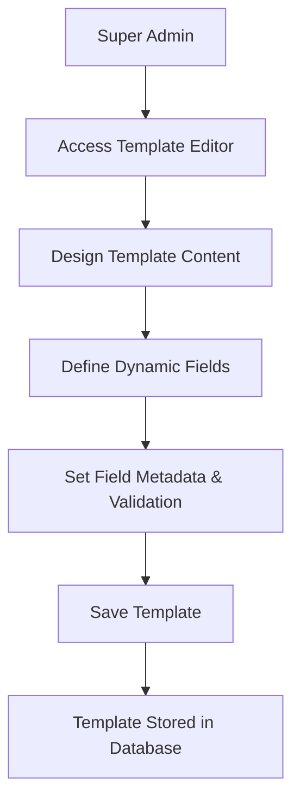
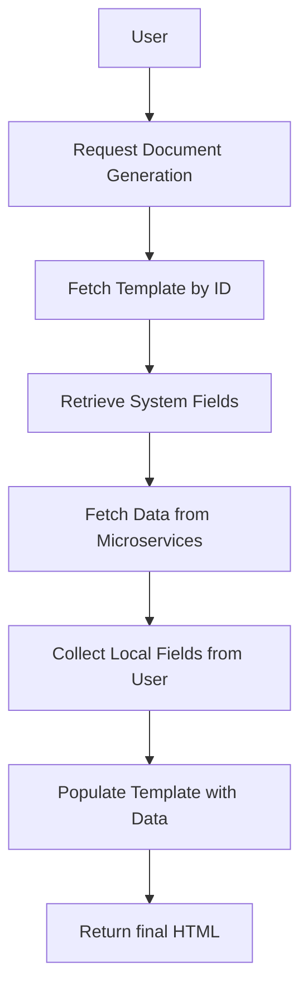

# DocumentTemplate Management Microservice

## Overview

The **DocumentTemplate Management Microservice** enables super administrators to create, manage, and render document templates with dynamic fields. These templates can include both system-fetched data from other microservices and local user-provided inputs. This microservice facilitates the generation of personalized documents.

---

## Table of Contents

- [Key Features](#key-features)
- [Use Cases](#use-cases)
- [API Endpoints](#api-endpoints)
- [Data Model](#data-model)
- [Activity Diagrams](#activity-diagrams)
- [Integration with Other Microservices](#integration-with-other-microservices)
- [Validation and Error Handling](#validation-and-error-handling)
- [Security Considerations](#security-considerations)
- [Getting Started](#getting-started)
- [Examples](#examples)
- [Contributors](#contributors)
- [License](#license)

---

## Key Features

- **Template Management**
  - Create, update, retrieve, and soft delete document templates.
  - Version control to track changes over time.
- **Dynamic Fields**
  - **System Fields**: Data fetched from other microservices (e.g., user details).
  - **Local Fields**: Data provided by the end-user during document generation.
- **Template Rendering**
  - Combine templates with dynamic fields to generate final documents.
  - Support for placeholders in template content.
- **Integration**
  - Fetch dynamic data from other microservices (e.g., UserData, PayrollService).
- **Validation**
  - Field-level validation rules (e.g., required, pattern matching).

---

## Use Cases

### 1. HR Department Generating Absence Certificates

- **Actors**: Super admin
- **Process**:
  1. Super Admin creates an "Absence Certificate" template.
  2. Defines dynamic fields like `{{firstName}}`, `{{lastName}}` (system fields), and `{{reason}}` (local field).
  3. When an Team lead requests an absence certificate:
  4. System fields are automatically populated from the UserData microservice.
  5. Final document is rendered HTML and provided to generateDocument microservice.

---

## API Endpoints


### 1. Create Template

- **Endpoint**: `POST /templates`
- **Description**: Creates a new document template.
- **Headers**:
  - `Content-Type: application/json`
  - `Authorization: Bearer <token>`
- **Request Body**:

  ```json
  {
    "name": "string",
    "description": "string",
    "category": "string",
    "templateContent": "string",
    "dynamicFields": [
      {
        "name": "string",
        "source": "system" | "local",
        "sourceDetails": {
          "serviceName": "string",
          "endpoint": "string",
          "key": "string",
          "localDefaultValue": "string"
        },
        "type": "string" | "number" | "date" | "boolean",
        "validation": {
          "required": true,
          "pattern": "string",
          "minLength": 0,
          "maxLength": 255
        }
      }
      // Additional dynamic fields...
    ]
  }
  ```

- **Responses**:
  - **201 Created**: Template created successfully.
  - **400 Bad Request**: Validation error in the request body.
  - **401 Unauthorized**: Authentication failed.

### 2. Retrieve Template

- **Endpoint**: `GET /templates/{id}`
- **Description**: Retrieves a specific template by its ID.
- **Headers**:
  - `Authorization: Bearer <token>`
- **Responses**:
  - **200 OK**: Returns the template details.
  - **404 Not Found**: Template does not exist.
  - **401 Unauthorized**: Authentication failed.

### 3. List Templates

- **Endpoint**: `GET /templates`
- **Description**: Retrieves a list of templates, optionally filtered by category.
- **Headers**:
  - `Authorization: Bearer <token>`
- **Query Parameters**:
  - `category` (optional): Filter by template category.
- **Responses**:
  - **200 OK**: Returns a list of templates.
  - **401 Unauthorized**: Authentication failed.

### 4. Update Template

- **Endpoint**: `PUT /templates/{id}`
- **Description**: Updates an existing template.
- **Headers**:
  - `Content-Type: application/json`
  - `Authorization: Bearer <token>`
- **Request Body**:

  ```json
  {
    "name": "string",
    "description": "string",
    "category": "string",
    "templateContent": "string",
    "dynamicFields": [ /* ... */ ]
  }
  ```

- **Responses**:
  - **200 OK**: Template updated successfully.
  - **400 Bad Request**: Validation error.
  - **404 Not Found**: Template does not exist.
  - **401 Unauthorized**: Authentication failed.

### 5. Delete Template

- **Endpoint**: `DELETE /templates/{id}`
- **Description**: Deletes a template by its ID.
- **Headers**:
  - `Authorization: Bearer <token>`
- **Responses**:
  - **204 No Content**: Template deleted successfully.
  - **404 Not Found**: Template does not exist.
  - **401 Unauthorized**: Authentication failed.

---

## Data Model

### Template Object

- **Fields**:
  - `id` (string, UUID): Unique identifier.
  - `name` (string): Template name.
  - `description` (string, optional): Brief description.
  - `category` (string): Category of the template (e.g., HR, Finance).
  - `templateContent` (string): The actual content with placeholders.
  - `dynamicFields` (array of DynamicField): List of dynamic fields used in the template.
  - `version` (string): Template version (e.g., "v1.0").
  - `createdBy` (string): ID of the super admin who created the template.
  - `createdAt` (timestamp): Creation timestamp.
  - `updatedAt` (timestamp): Last updated timestamp.

### DynamicField Object

- **Fields**:
  - `name` (string): Name of the field (used in placeholders).
  - `source` (string): `"system"` or `"local"`.
  - `sourceDetails` (object, optional): Details for fetching system fields.
    - `serviceName` (string): Name of the microservice.
    - `endpoint` (string): API endpoint to fetch data.
    - `key` (string): Key to extract from the response.
    - `localDefaultValue` (string, optional): Default value for local fields.
  - `type` (string): Data type (`string`, `number`, `date`, `boolean`).
  - `validation` (object, optional): Validation rules.
    - `required` (boolean): Whether the field is required.
    - `pattern` (string, optional): Regex pattern for validation.
    - `minLength` (number, optional): Minimum length.
    - `maxLength` (number, optional): Maximum length.

---

## Activity Diagrams

### 1. Template Creation Process



### 2. Document Generation Process




---

## Integration with Other Microservices

- **UserData Microservice**: Provides user details like first name, last name, and email.

- **other Microservice**: Provides other data.

**System Field Retrieval Process**:

1. Identify system fields in the template.
2. For each system field:
   - Use `sourceDetails` to determine which microservice and endpoint to call.
   - Make API requests to fetch required data.
   - Extract data using the specified `key`.

---

## Validation and Error Handling

- **Field-Level Validation**:
  - Enforced based on the `validation` rules defined in each dynamic field.
  - Includes checks for required fields, pattern matching, and length constraints.
- **Error Responses**:
  - **400 Bad Request**: Returned when validation fails.
  - **401 Unauthorized**: Authentication token is missing or invalid.
  - **403 Forbidden**: User lacks necessary permissions.
  - **404 Not Found**: Resource does not exist.
  - **500 Internal Server Error**: Unexpected server error.

**Example Error Response**:

```json
{
  "status": 400,
  "error": "Bad Request",
  "message": "Field 'name' is required."
}
```

---

## Security Considerations

- **Authentication**:
  - All endpoints require a valid JWT token.
  - Tokens are verified before processing requests.
- **Authorization**:
  - Only users with the `super_admin` role can create, update, or delete templates.
  - Regular users can only retrieve templates if necessary.

## Examples

### Creating a Template

**Request**:

```bash
POST /templates HTTP/1.1
Host: your-domain.com
Content-Type: application/json
Authorization: Bearer <token>

{
  "name": "Absence Certificate",
  "description": "Used for employee absence validation",
  "category": "HR",
  "templateContent": "<html><body>Dear {{firstName}} {{lastName}},</body></html>",
  "dynamicFields": [
    {
      "name": "firstName",
      "source": "system",
      "sourceDetails": {
        "serviceName": "UserData",
        "endpoint": "/users/{id}",
        "key": "firstName"
      },
      "type": "string",
      "validation": { "required": true }
    },
    {
      "name": "reason",
      "source": "local",
      "type": "string",
      "validation": { "required": true, "maxLength": 255 }
    }
  ]
}
```

**Response**:

```json
{
  "id": "e4d1c0a0-5d9b-4c4f-9c4a-2f5c0d1e2f3a",
  "name": "Absence Certificate",
  "description": "Used for employee absence validation",
  "category": "HR",
  "templateContent": "<html><body>Dear {{firstName}} {{lastName}},</body></html>",
  "dynamicFields": [
    {
      "name": "firstName",
      "source": "system",
      "sourceDetails": {
        "serviceName": "UserData",
        "endpoint": "/users/{id}",
        "key": "firstName"
      },
      "type": "string",
      "validation": { "required": true }
    },
    {
      "name": "reason",
      "source": "local",
      "type": "string",
      "validation": { "required": true, "maxLength": 255 }
    }
  ],
  "version": "v1.0",
  "createdBy": "admin-uuid",
  "createdAt": "2023-10-01T12:00:00Z",
  "updatedAt": "2023-10-01T12:00:00Z"
}
```
