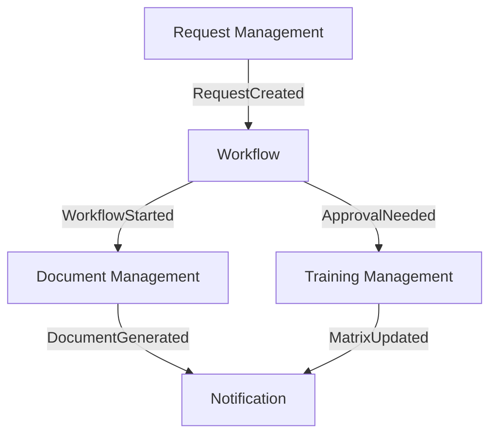

## Core Microservices

### 1. Document Management Service

#### Domain: Document Management

#### Purpose

- Central service for all document-related operations
- Handles document generation, storage, and lifecycle management
- Manages document templates and versioning

#### Key Features

- Document template management
- Digital and physical document generation
- Version control and tracking
- GED system integration
- Document metadata management

#### Domain Events

- DocumentRequested
- DocumentGenerated
- DocumentVersioned
- DocumentStored
- TemplateUpdated

### 2. Request Management Service

#### Domain: Request Processing

#### Purpose

- Unified service for handling all types of requests
- Single entry point for document and approval requests
- Request lifecycle management

#### Request Types

- Administrative documents (work certificates)
- Authorization requests (absence, holidays)
- Production-related requests (clocking, modifications)
- Training-related requests

#### Domain Events

- RequestInitiated
- RequestStatusUpdated
- RequestApproved
- RequestRejected
- RequestCancelled

### 3. Workflow Service

#### Domain: Process Orchestration

#### Purpose

- Manages approval workflows across different request types
- Handles SLA monitoring and escalations
- Orchestrates multi-step approval processes

#### Key Features

- Dynamic workflow definition
- SLA tracking
- Approval chain management
- Escalation handling

#### Domain Events

- WorkflowStarted
- ApprovalRequired
- ApprovalCompleted
- SLABreached
- WorkflowCompleted

### 4. Training Management Service

#### Domain: Training & Certification

#### Purpose

- Manages all training-related processes
- Handles versatility matrix updates
- Manages certifications and competencies

#### Key Features

- Training schedule management
- Certification tracking
- Versatility matrix maintenance
- Training document management

#### Domain Events

- TrainingScheduled
- CertificationCompleted
- VersatilityMatrixUpdated
- CompetencyAchieved

### 5. Identity & Access Service

#### Domain: Security & Authorization

#### Purpose

- Centralized authentication and authorization
- Role-based access control
- User profile management

#### Key Features

- Azure AD integration
- Role management
- Permission handling
- User profile maintenance

#### Domain Events

- UserAuthenticated
- RoleAssigned
- PermissionUpdated

### 6. Notification Service

#### Domain: Communication

#### Purpose

- Handles all system notifications
- Manages communication between users
- Provides real-time updates

#### Key Features

- Multi-channel notifications
- Template-based messaging
- SLA breach alerts
- Status updates

#### Domain Events

- NotificationSent
- AlertTriggered
- MessageDelivered

## Supporting Services

### 7. Analytics Service

#### Purpose

- Provides business insights and reporting
- Monitors system performance
- Tracks KPIs and metrics

#### Key Features

- Real-time dashboards
- SLA compliance reporting
- Audit trailing
- Performance metrics

## Domain Integration Patterns

### Event-Driven Communication

### Service Boundaries

- Each service owns its data and business logic
- Communication via well-defined events and commands
- Clear separation of concerns based on business capabilities

### Data Consistency

- Each service maintains its own database
- Event sourcing for audit trails
- CQRS for complex queries and reporting

## Key Improvements

1. **Consolidated Services**: Reduced from 11 to 7 core services
2. **Clearer Domain Boundaries**: Each service aligned with specific business capability
3. **Simplified Integration**: Event-driven communication between services
4. **Better Scalability**: Independent scaling of core services
5. **Reduced Complexity**: Eliminated overlapping responsibilities

Here's a concise explanation of the services removed during optimization:

1. **Time & Services Service** - Merged into Request Management Service since it's essentially a specialized type of request handling
2. **Payroll Service** - Consolidated into Document Management Service as it primarily deals with document generation and storage
3. **Administration Service** - Merged into Request Management Service as administrative requests follow the same patterns as other requests
4. **Labor Relations Service** - Integrated into Request Management Service as transportation/expense requests are just specialized request types
5. **User Service** - Renamed to Identity & Access Service with expanded scope for better clarity

Key rationale:

- Many services were handling specialized request types but following the same patterns
- Document generation was spread across multiple services unnecessarily
- Better alignment with DDD principles by focusing on core domains rather than organizational structure
- Reduced complexity and improved maintainability while maintaining all functional requirements
